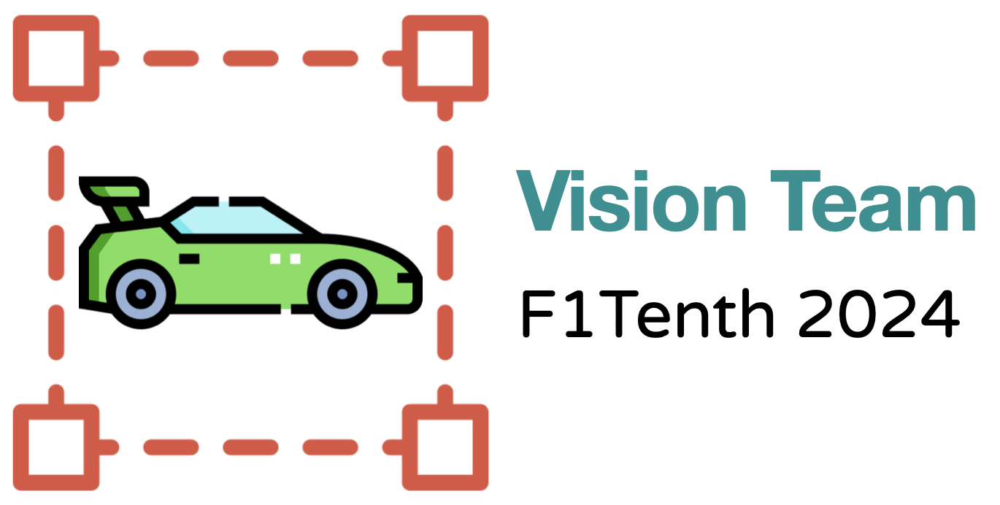
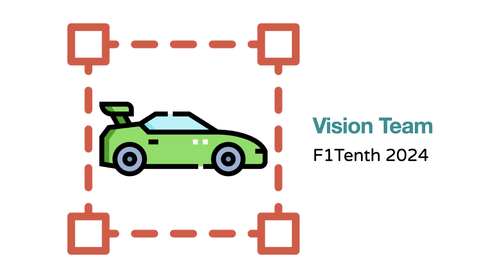

# Vision Team - F1Tenth 2024

  

<!--

  

 
 -->

## Demo

  

<!--  -->

## Project Overview
This project focuses on developing a vision-based solution for detecting rival vehicles in the F1Tenth competition environment. The primary challenge was to accurately identify dynamic objects in real time while considering the vehicle's computational and mechanical constraints.

<!--The proposed solution integrates advanced image processing techniques with camera-generated RGB and depth images. After evaluating several algorithms such as SSD, Mask R-CNN, and Reinforcement Learning, the YOLO-World model was selected for its optimal balance between accuracy and speed. The vision module was implemented using the ROS2 platform, with Docker providing stability and isolation for the system.-->

## Features
- **Real-Time Object Detection**: Detects and tracks rival vehicles in a dynamic environment.
- **Algorithm Selection**: YOLO-World chosen for its superior speed-accuracy trade-off.
- **Platform Integration**: Leveraged ROS2 and Docker for modularity and robustness.

## Key Technologies
- **YOLO-World**: A state-of-the-art object detection model optimized for open-vocabulary tasks.
- **Intel RealSense**: Cameras providing high-resolution RGB and depth images.
- **ROS2**: Middleware framework ensuring modularity and real-time performance.
- **Docker**: Containerization for an isolated and stable environment.

## Credits
- **Team Members**:
    - Toam Elharar
    - Golan Gershonowitz
    - Yuval Goshen
    
- **Acknowledgments**:
  - MRS Lab at Technion
  - CRML Group

## References
- [Nicolas Baumann et al., ForzaETH Race Stack](https://arxiv.org/abs/2403.11784)
- [Tianheng Cheng et al., YOLO-World](https://arxiv.org/abs/2401.17270)
- [Joseph Redmon et al., YOLO](https://arxiv.org/abs/1506.02640)

---
